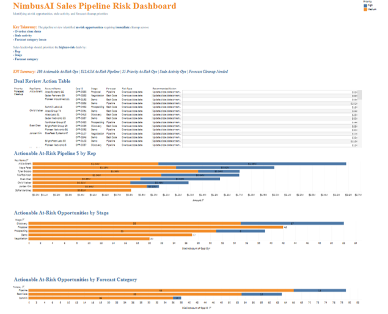
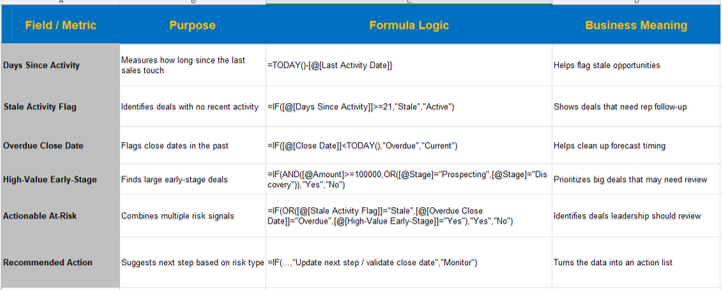
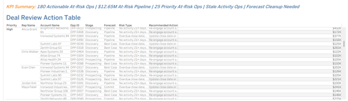
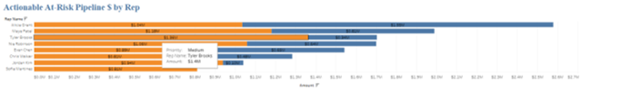

# NimbusAI Sales Pipeline Risk Dashboard

A Sales Ops case study built in Tableau to identify at-risk pipeline, stale activity, forecast cleanup needs, and where leadership should focus before the Monday forecast call.

## Live Dashboard

View the Tableau Public dashboard here:
**[NimbusAI Sales Pipeline Risk Dashboard]((https://public.tableau.com/app/profile/nathaniel.cooper2501/viz/NimbusAISalesPipelineRiskDashboard/NCPipelineRiskDashboard)

## Dashboard Preview

## The Scenario

It is Friday afternoon. The week is basically limping toward the finish line. People are mentally halfway to the weekend, Slack notifications are being ignored with Olympic-level discipline, and then the VP of Sales drops a message:

> “Can we get a quick view of pipeline risk before Monday’s forecast call?”

Translation:

> “Something feels off in the pipeline, and I need to know where the fire is before I walk into a room full of leaders asking questions.”

That was the setup for this case study.

NimbusAI had pipeline in the system, but the real question was not just whether deals existed.

The real question was:

**Which deals are healthy, and which ones are quietly turning into forecast problems?**

## The Business Problem

Sales leaders do not need another giant spreadsheet with 300 rows and a prayer.

They need quick answers:

* How many opportunities are at risk?
* How much pipeline is exposed?
* Which reps own the most at-risk pipeline?
* Which sales stages have the most risk?
* Which forecast categories need cleanup?
* Which specific deals should someone review first?

The goal was to turn messy pipeline data into a dashboard that helps leadership quickly see where the risk is, how big it is, and what should be cleaned up before the forecast call.

## My Approach

I built the analysis around pipeline risk signals that would matter in a real Sales Ops workflow:

* Overdue close dates
* Stale activity
* Forecast category issues
* High and medium priority opportunities
* Pipeline amount tied to at-risk deals
* Rep ownership
* Sales stage
* Recommended next action

I focused on formula-driven results from the dataset rather than manual assumptions. In a real-world Sales Ops setting, several of these items would be flagged as CRM hygiene issues that should be validated before leadership uses the numbers for a final forecast.

## Formula Logic & Data Prep

## Dashboard Sections

### Key Takeaway

The dashboard starts with a plain-English summary of what the pipeline review found and where sales leadership should focus.

### KPI Summary

The dashboard highlights:

* **180 actionable at-risk opportunities**
* **$12.65M in at-risk pipeline**
* **25 priority at-risk opportunities**
* Stale activity opportunities
* Forecast cleanup needs

### Deal Review Action Table

This table shows the actual deals that need attention. It includes the rep, account, opportunity details, stage, forecast category, risk type, amount, and recommended action.

This is the “start here” section.

Instead of telling a sales manager, “Go clean up your pipeline,” this table points to the specific deals that need review.

### At-Risk Pipeline by Rep

This view shows where the largest dollar exposure sits by rep.

A rep may not have the most risky deals by count, but they may own the highest dollar amount of risk. That matters when leadership is trying to protect the forecast.

### At-Risk Opportunities by Stage

This view shows where risk is building in the sales process.

If risk is concentrated in early stages, that could point to qualification issues. If it is concentrated in later stages, that could point to close date slippage, weak next steps, or forecast hygiene problems.

### At-Risk Opportunities by Forecast Category

This view shows which forecast categories may need cleanup before the forecast call.

Forecast categories should not be vibes. They should mean something.

## Key Insights

The dashboard surfaced several important takeaways:

* There are **180 actionable at-risk opportunities**, which suggests this is more than a one-off cleanup issue.
* There is **$12.65M in at-risk pipeline**, making this a real revenue visibility problem.
* Risk is not evenly spread across the business. Some reps, stages, and forecast categories carry more exposure than others.
* The Deal Review Action Table gives leadership a practical place to start instead of forcing everyone to hunt through raw CRM data.

## Recommended Actions

If I were handing this to the VP of Sales before Monday’s forecast call, I would recommend:

1. **Start with the highest-dollar at-risk opportunities.**
   These deals carry the most forecast exposure.

2. **Review stale activity and overdue close dates.**
   The goal is to separate real pipeline from wishful thinking.

3. **Tighten forecast category rules.**
   If a deal is marked Pipeline, Best Case, or Commit, the activity and close date should support that forecast position.

## Tools Used

* Tableau Public
* Excel / spreadsheet formulas
* CRM-style pipeline data
* Sales Ops analysis logic

## Skills Demonstrated

* Pipeline risk analysis
* Forecast hygiene review
* CRM data quality checks
* Dashboard design
* Sales operations reporting
* Data storytelling
* Executive-ready business summaries

## What I Learned

This project helped me think more like a Sales Ops Analyst because the work was not just about building charts.

It was about taking messy pipeline data and turning it into something leadership could actually use.

The dashboard needed to answer:

**Where is the risk, how big is it, and what should we do next?**

That is the part of Sales Ops I enjoy: connecting sales activity, CRM data, and leadership questions into something clear enough for people to act on.

Because nobody needs another dashboard just sitting there looking cute.

The dashboard needs to earn its keep.

## Final Summary

The NimbusAI Sales Pipeline Risk Dashboard helps sales leadership identify at-risk pipeline, prioritize cleanup efforts, and prepare for forecast conversations with more confidence.

Or, said less formally:

The VP of Sales asked, “Where are we exposed?”

This dashboard answers:

**“Right here. Start with these deals.”**
